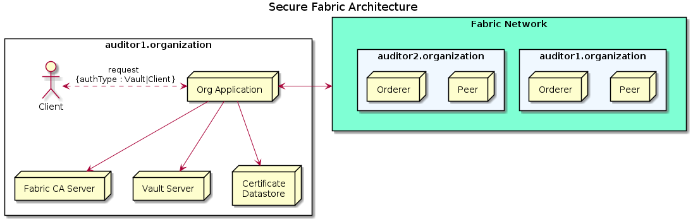
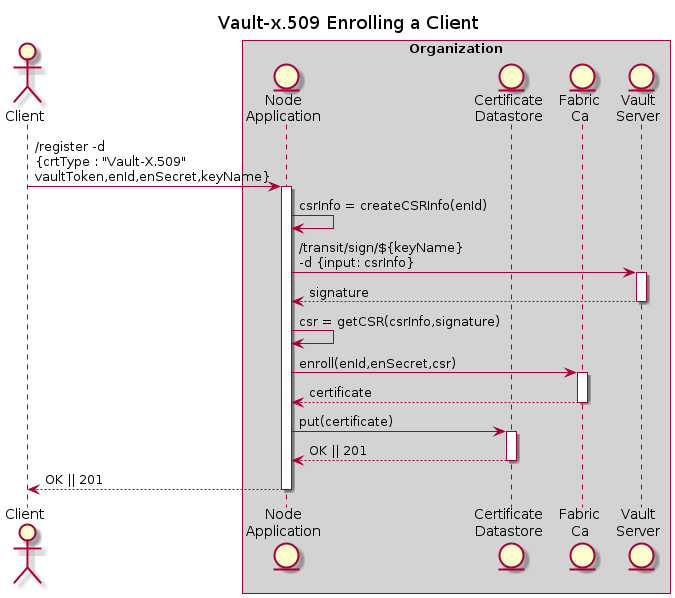
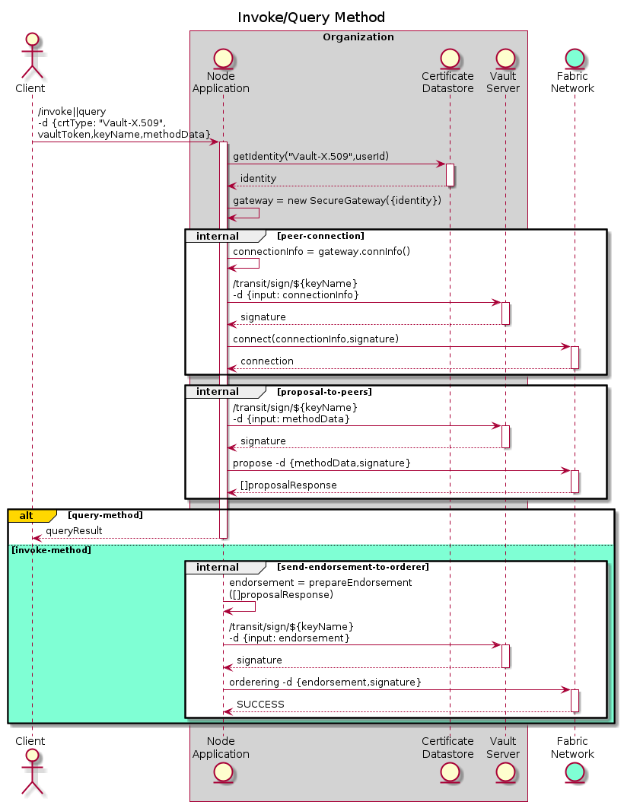
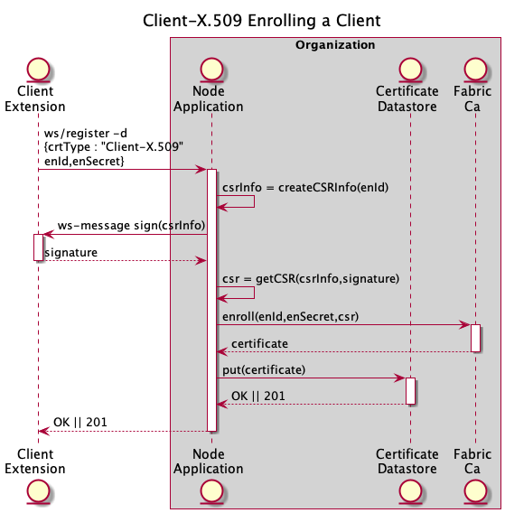
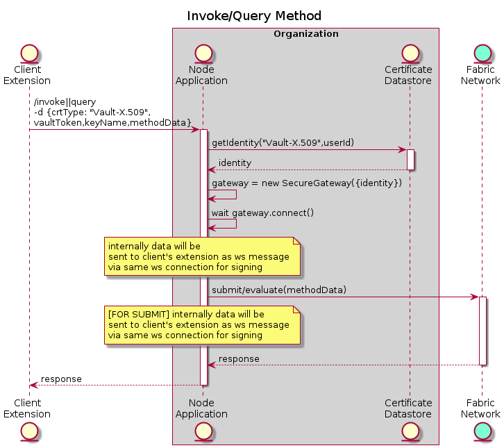

# Secure Fabric

Secure Fabric provides a solution to the fabric organization for managing their client's private key such that the client's private key is never brought to `Node Server` for singing. Currently `Secure fabric` provide a option of keeping client's private key into `Vault Transit Engine` or in browser `Extension`.

## Development

Running Test
- Setup development environment : `./scripts/dev.sh prepare`
- Run Test : `npm run test:provider`
- Clean development environment : `./scripts/dev.sh clean`

## Vault-X.509 Identity

Signing is done by `private` key stored with `Vault Transit Engine`

### Enrolling
For enrolling a already registered user. Enrollment and registration steps are separated so that client could re-enroll their certificate in case certificate expires/private is rotated(TBD) using a same endpoint.

### Invoke/Query Method

## Client-X.509 Identity

Signing is done by `private` key stored inside client's browser `Extension`

### Enrolling
For enrolling a already registered user. Enrollment and registration steps are separated so that client could re-enroll their certificate in case certificate expires/private is rotated(TBD) using a same endpoint.

### Invoke/Query Method

